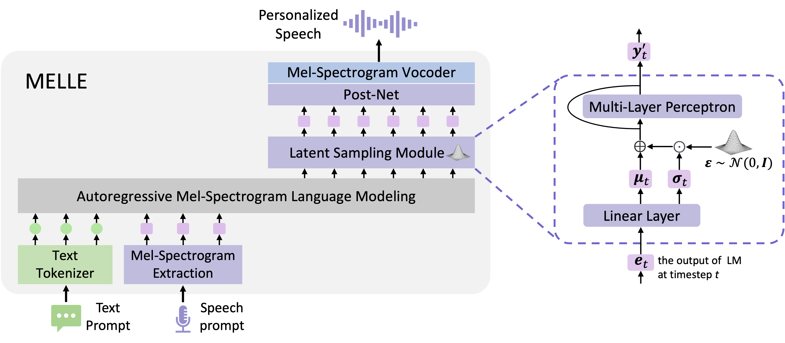

# MELLE: Autoregressive Speech Synthesis without Vector Quantization

[](https://arxiv.org/abs/2407.08551)
[](https://www.python.org/)
[](https://pytorch.org/)
[](LICENSE)

An **unofficial PyTorch implementation** of "[Autoregressive Speech   Synthesis without Vector Quantization](https://arxiv.org/abs/2407.08551)" paper. This repository provides a complete pipeline for training and inference of the MELLE model.

<div align=center>
  
</div>

<br>

As shown in `librispeech_exp/melle/step_400000testclean_results.txt`, we used the Llama tokenizer and trained for 400,000 steps on the LibriSpeech-960h training set. On the cross-sentence evaluation of the 3–10 second subset of LibriSpeech test-clean, the WER (Word Error Rate) was 5.69%, with `spk_sim_r`: 0.5047 and `spk_sim_o`: 0.4890. 

Sample audios can be found in the `librispeech_exp/melle/step_400000testclean_generate_samples` folder.

Vocoder link: [https://huggingface.co/mechanicalsea/speecht5-tts](https://huggingface.co/mechanicalsea/speecht5-tts)

**NOTE**: As suggested in the original paper, when training on a smaller dataset of LibriSpeech's size, utilizing a smaller vocabulary (such as phonemes) is anticipated to yield better results.

## 🚀 Quick Start

### Environment Setup

```bash
# Easy prepare environment
bash set_env.sh

# Here is the detail environment setup
# Create conda environment
conda create -n melle python==3.10 -y
conda activate melle

# Install PyTorch and dependencies
pip3 install torch==2.6.0 torchvision==0.21.0 torchaudio==2.6.0 --index-url https://download.pytorch.org/whl/cu118
pip3 install -U xformers==0.0.29.post3 --index-url https://download.pytorch.org/whl/cu118

# Install additional requirements
pip install transformers numpy tqdm jiwer webrtcvad librosa
```

### Data Preparation

1. **Download LibriSpeech Dataset**:
   ```bash
   # Download and extract LibriSpeech train-clean-360 and train-clean-100
   # Place data in appropriate directory structure
   ```

2. **Prepare Training Data**:
   - The training data should be in JSONL format with `transcription` and `audio_path` fields
   - Example data files are provided in `data/` directory:
     - `librispeech_train960.jsonl` - Training data (960 hours)
     - `librispeech_testclean_prompt.jsonl` - Test prompts
     - `librispeech_testclean_generate.jsonl` - Generation targets

### Training

Use the provided shell script for easy training:

```bash
CUDA_VISIBLE_DEVICES=0,1,2,3 torchrun --nnodes=1 --nproc_per_node=4 --master_port=12345 \
    DDP_main.py \
    --train_json data/librispeech_train960.jsonl \
    --batch_frames 50000 \
    --save_dir librispeech_exp \
    --using_postnet \
    --norm layer \
    --transformer_activation relu \
    --prenet_activation relu \
    --postnet_activation tanh \
    --exp_name melle \
    --save_interval 50000
```

### Training Parameters

- `--batch_frames`: Maximum frames per batch (controls memory usage)
- `--lr`: Learning rate (default: 5e-4)
- `--epochs`: Number of training epochs
- `--max_update_step`: Maximum training steps (default: 400,000)
- `--using_postnet`: Enable PostNet for enhanced quality
- `--using_rope`: Use RoPE instead of learned positional embeddings
- `--norm`: Normalization type (`rms` or `layer`)
- `--transformer_activation`: Activation function for Transformer (`relu`, `silu`, `tanh`)

### Inference

#### Single Sample Inference

```python
from MELLE import MELLE
from transformers import LlamaTokenizerFast
import torch

# Load model
model = MELLE(
    using_rope=False,
    using_postnet=True,
    using_qwen2mlp=False,
    norm='layer',
    transformer_activation='relu',
    prenet_activation='relu',
    postnet_activation='tanh',
).to('cuda')

# Load checkpoint
checkpoint = torch.load('librispeech_exp/melle/step_400000.pt')
model.load_state_dict(checkpoint['model'])
model.eval()

# Generate speech
outputs = model.inference(prompt_mel, txt, max_length=2000)
```

#### Batch Inference

```bash
# Test on clean test set
python infer_test_clean.py

# Compute metrics
python infer_compute_metrics.py
```

## 🎯 Model Configurations

### Available Configurations

The model supports various architectural choices:

**Normalization**: 
- `rms`: RMSNorm (Qwen2-style)
- `layer`: LayerNorm

**Activations**:
- `relu`: ReLU activation
- `silu`: SiLU/Swish activation  
- `tanh`: Tanh activation

**Position Encoding**:
- `--using_rope`: Rotary Position Embedding (RoPE)
- Default: Learned positional embeddings

**Architecture Options**:
- `--using_postnet`: Enable convolutional PostNet
- `--using_qwen2mlp`: Use Qwen2-style MLP layers

## 📊 Results
We provide the results of the MELLE model on the LibriSpeech dataset and the results are stored in `librispeech_exp/melle/` directory.

## 📜 Citation

If you find this work inspiring or use our codebase in your research, please consider giving a star ⭐ and a citation:

```bibtex
@article{meng2024melle,
  title={Autoregressive speech synthesis without vector quantization},
  author={Meng, Lingwei and Zhou, Long and Liu, Shujie and Chen, Sanyuan and Han, Bing and Hu, Shujie and Liu, Yanqing and Li, Jinyu and Zhao, Sheng and Wu, Xixin and others},
  journal={arXiv preprint arXiv:2407.08551},
  year={2024}
}
```

## 📄 License

This project is licensed under the MIT License - see the [LICENSE](LICENSE) file for details.

